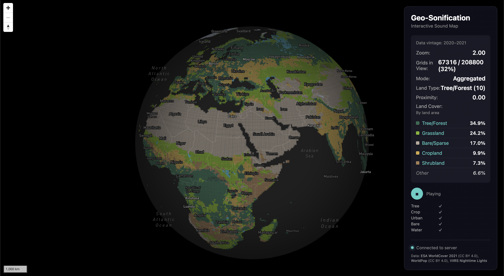

# Geo-Sonification: Interactive Sound Map

[](https://github.com/halicwang/geo-sonification/actions/workflows/ci.yml)
[](LICENSE)


<p align="center">
  
</p>

Turn geographic data into soundscapes. This project maps ESA WorldCover satellite land-cover data to ambient audio — pan across forests, cities, and oceans, and hear the landscape change in real-time, powered by your own Google Earth Engine exports.

### How it works

- Frontend (Mapbox) visualizes **landcover** and streams viewport metrics to a Node.js server.
- The server computes audio parameters (5-bus fold-mapping, land-coverage ratio) and sends them back via WebSocket.
- The browser's Web Audio engine plays ambient soundscapes that reflect the land cover composition of the current viewport.

## Architecture

```
┌─────────────────┐      ┌─────────────────┐
│   Mapbox Map    │ WS   │   Node.js       │
│   (Frontend)    │ ───> │   Server        │
│                 │      │                 │
│  viewport ──────┼──────┼─> calculate     │
│  interaction    │      │   stats +       │
│                 │      │   audioParams   │
│  audio-engine ◄─┼──────┼── busTargets,   │
│  (Web Audio)    │  WS  │   coverage …    │
└─────────────────┘      └─────────────────┘
```

## Quick Start

> **One-click start (macOS):** Double-click `start.command` to start the Node server and open the browser. Requires steps 1–4 below to be completed first.

### 1. Prerequisites

- Node.js 18+
- Mapbox account (for access token)
- Five ambience WAV files in `frontend/audio/ambience/` (gitignored; repository only includes `.gitkeep`):
    - **Files**: `tree.wav`, `crop.wav`, `urban.wav`, `bare.wav`, `water.wav`
    - **Format**: WAV, 48 kHz, stereo recommended (mono works — Web Audio upmixes automatically)
    - **Duration**: any length, but the last 1.875 s must be an exact copy of the first 1.875 s. The engine crossfades outgoing/incoming voices over this overlap window — identical head and tail content is what makes the loop seamless. Total duration = desired cycle length + 1.875 s (e.g., 120 s cycle → 121.875 s file)
    - **Source**: record your own or obtain ambient loops from sites like [Freesound](https://freesound.org/). Trim to your desired cycle length in a DAW, then copy the first 1.875 s and append it to the end

### 2. Get Mapbox Token

1. Go to https://account.mapbox.com/access-tokens/
2. Create a new token or copy your default public token
3. Copy `frontend/config.local.js.example` to `frontend/config.local.js` and paste your token

### 3. Install Dependencies

```bash
npm install && cd server && npm install
```

### 4. Run GEE Export (if not done)

Run the scripts in `gee-scripts/` and download CSVs to `data/raw/`. See `gee-scripts/README_EXPORT.md`.

**Before starting the server**: Confirm CSVs in `data/raw/` match the schema in `data/raw/SCHEMA.md`. If you have old `loss_*` CSVs, re-export and replace them. Validate with `npm run check:csv`. Delete `data/cache/` then start Node.

### 5. Start the System

**Terminal: Start Node.js Server**

```bash
npm start
```

**Browser: Open Frontend**

- Navigate to http://localhost:3000
- Click the play button in the info panel to start audio

### 6. Interact!

- Pan and zoom the map
- Watch the info panel update (landcover UI)
- Listen to the ambient soundscape change as the viewport moves across different land cover types

## File Structure

<details>
<summary>Click to expand full directory tree</summary>

```
geo-sonification/
├── package.json                          # Root scripts: start, dev, check:csv, clean:cache
├── .env.example                          # All configurable env vars with defaults
├── start.command                         # macOS one-click launcher (double-click)
├── data/
│   ├── raw/                              # GEE-exported CSVs (source data, do not delete)
│   │   ├── SCHEMA.md                     # Data contract (fields, types, ranges)
│   │   └── <continent>_grid.csv          # One CSV per continent (exported from GEE)
│   ├── cache/                            # Derived data (safe to delete, auto-rebuilt)
│   │   ├── all_grids.json
│   │   └── normalize.json
│   └── tiles/                            # PMTiles (built by scripts/build-tiles.js)
│       └── grids.pmtiles
├── docs/
│   ├── ARCHITECTURE.md                   # System architecture
│   ├── DEVLOG.md                         # Development log index + recording guide
│   ├── plans/                            # Design proposals, milestone specs
│   └── devlog/                           # Development logs and debugging records
├── gee-scripts/
│   ├── README_EXPORT.md                  # GEE export instructions
│   └── <continent>_grid.js               # GEE export scripts (one per continent)
├── server/
│   ├── package.json
│   ├── index.js                          # Express routes, WebSocket, startup
│   ├── config.js                         # Env parsing, aggregation settings
│   ├── landcover.js                      # ESA WorldCover class metadata + normalization
│   ├── audio-metrics.js                  # Audio computation: bus fold-mapping, proximity, delta, ocean detection
│   ├── delta-state.js                    # Per-client delta state management
│   ├── mode-manager.js                   # Aggregated ↔ per-grid hysteresis
│   ├── viewport-processor.js             # Viewport processing orchestrator
│   ├── data-loader.js                    # CSV parsing, caching, deduplication
│   ├── spatial.js                        # Spatial index, viewport stats, bounds validation
│   ├── normalize.js                      # p1/p99 percentile normalization
│   ├── types.js                          # JSDoc type definitions
│   └── __tests__/                        # Jest test suite
├── frontend/
│   ├── index.html
│   ├── style.css
│   ├── main.js                           # Entry point — wires modules, DOMContentLoaded
│   ├── config.js                         # Shared state, server config loading, client ID
│   ├── landcover.js                      # Landcover metadata lookups (name, color, XSS escape)
│   ├── map.js                            # Mapbox init, grid overlay, viewport tracking, HTTP fallback
│   ├── websocket.js                      # WebSocket connection with exponential-backoff reconnect
│   ├── ui.js                             # DOM updates: stats panel, connection status, toast
│   ├── audio-engine.js                   # Web Audio engine: 5-bus EMA crossfade + ocean detector
│   ├── audio/ambience/                   # Loopable stereo WAVs (one per bus)
│   └── config.local.js.example           # Mapbox token template (copy to config.local.js)
└── scripts/
    ├── check_csv_schema.js                # CSV schema validator
    ├── build-tiles.js                     # Tile builder
    ├── benchmark-viewport.js              # Viewport processing benchmark
    ├── smoke-worldcover.js                # WorldCover smoke test
    ├── setup-git-hooks.sh                 # Git hooks installer
    └── test_bounds_validation.sh          # Bounds regression test
```

</details>

## Data Organization

This project uses a single, "now-only" schema (no historical time series). Each continent CSV contains 0.5 x 0.5 degree grid cells. See `data/raw/SCHEMA.md` for the full field spec (types, units, allowed ranges).

## Viewport Aggregation (V2)

- Landcover breakdown and dominant landcover are computed **by land area** (sum of `land_area_km2`), not by grid count.
- Forest and population are aggregated by land area: forest = area-weighted mean of per-cell `forest_pct`, population density = `sum(population_total) / sum(land_area_km2)`.
- Nightlight uses `nightlight_p90` for viewport display; viewport nightlight is an **area-weighted mean of cell-level p90** (approximation, not the true viewport p90).

All server settings (ports, aggregation mode, coastal weighting, cache) are configurable via environment variables. See `.env.example` for a full list with defaults. Copy to `.env` and modify as needed.

Caches live in `data/cache/` and include aggregation version in their keys. Changing aggregation or coastal settings triggers recalculation. Clear all caches with `npm run clean:cache`.

## Sound Mapping

Five ambience WAV loops represent different land cover types. Land cover channels are folded into 5 audio buses:

- **Tree bus**: classes 10, 20, 30, 90, 95, 100 (natural vegetation)
- **Crop bus**: class 40
- **Urban bus**: class 50
- **Bare bus**: class 60
- **Water bus**: classes 70, 80 + coverage-linear ocean mix

The audio engine uses `coverage` (fraction of viewport cells with land data) as a linear mix rule: `coverage=0%` maps to `land:ocean = 0:100`, `coverage=40%` maps to `100:0`, and values in between interpolate linearly (`land=coverage/0.4`, `ocean=1-land`). Above 40%, playback stays pure land. Ocean rides the Water bus while land buses are attenuated in low-coverage mode. EMA smoothing provides gradual transitions.

Ambience WAV files are local assets and are not committed (`frontend/audio/ambience/*.wav` is ignored). If a file is missing, the corresponding bus shows a loading error and that bus remains silent.

### Audio Controls and Lifecycle

- Play/Stop toggle in the info panel
- Per-bus loading progress indicators
- Audio automatically suspends when the browser tab is hidden (`visibilitychange`), resumes and snaps to current targets on return
- When viewport updates pause (for example, map is stationary), audio keeps looping at the last targets; no idle auto-fade is applied.
- HTTP fallback (`POST /api/viewport`) also updates `audioParams`, so audio keeps tracking map movement when WebSocket is unavailable.

### Requirements

- Modern browser with Web Audio API (Chrome 66+, Firefox 76+, Safari 14.1+)
- Sufficient bandwidth for initial WAV download

## Troubleshooting

### Server won't start / CSV schema mismatch

- Re-export CSVs using `gee-scripts/*.js` and place them into `data/raw/`
- Delete caches: `rm -rf data/cache`

### WebSocket disconnected

- The server sends a ping every 30 seconds; clients that don't respond are terminated automatically
- Make sure Node server is running: `npm start`
- Check console for errors

### Map not loading

- Verify Mapbox token is set in `frontend/config.local.js`
- Check browser console for errors

### No grid overlay

- Run GEE export first for each continent
- Place CSV files in `data/raw/` (e.g., `data/raw/africa_grid.csv`, `data/raw/asia_grid.csv`, etc.)
- Each file should match the schema in `data/raw/SCHEMA.md`

## API Endpoints

### HTTP

- `GET /health` — Health check (used by `start.command` to wait for readiness)
- `GET /api/config` — Server configuration (ports, grid size, landcover metadata)
- `POST /api/viewport` — Calculate stats for given bounds (HTTP fallback when WebSocket is unavailable)

### WebSocket

Connect to `ws://localhost:3001` (default port, configurable via `WS_PORT`).

**Client → Server:**

```json
{ "type": "viewport", "bounds": [west, south, east, north], "zoom": 12.5 }
```

`zoom` is recommended — it drives the proximity signal and low-pass filter cutoff frequency. If omitted, proximity defaults to 0 (fully distant).

**Server → Client:**

```json
{ "type": "stats", "audioParams": { "busTargets": [...], "proximity": 0.8, "coverage": 0.95 }, "mode": "aggregated", ... }
```

See `docs/ARCHITECTURE.md` for the full field reference.

## Contributing

Contributions are welcome! Please open an issue first to discuss what you would like to change before submitting a pull request.

This project uses [Conventional Commits](https://www.conventionalcommits.org/) enforced by [commitlint](https://commitlint.js.org/). Run `npm run lint` and `npm run format:check` before committing.

## Data Sources

This project uses the following third-party datasets (obtained independently via Google Earth Engine export, not distributed with this repository):

- **ESA WorldCover 2021** — CC BY 4.0 — https://esa-worldcover.org/
- **WorldPop 2020** — CC BY 4.0 — https://www.worldpop.org/
- **VIIRS Nighttime Lights (NASA/NOAA)** — Public domain — https://eogdata.mines.edu/products/vnl/

See `NOTICE` for full attribution details.
